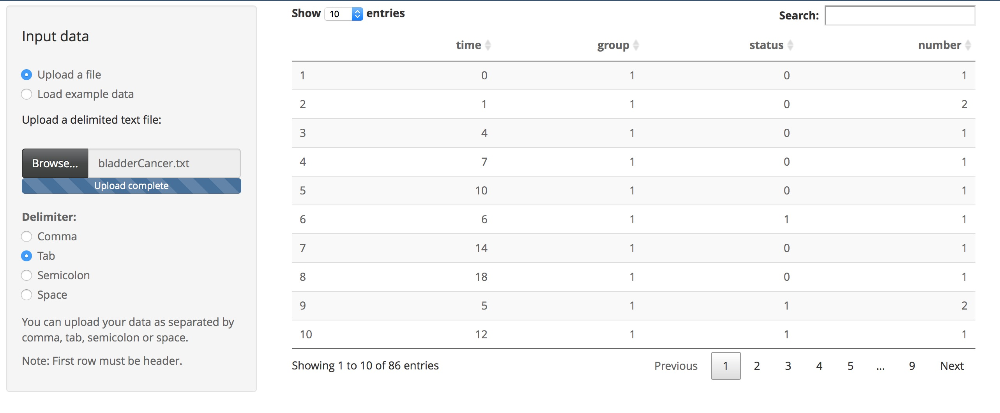
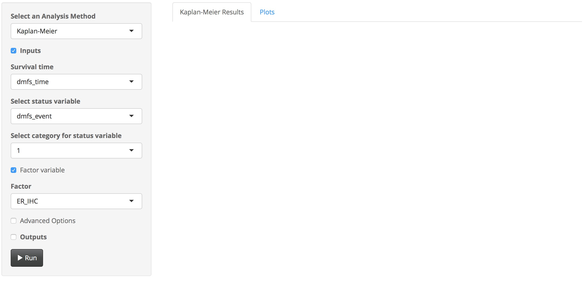
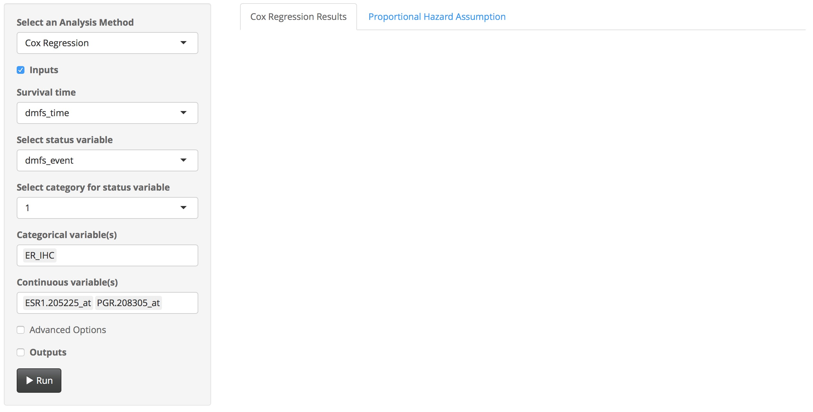
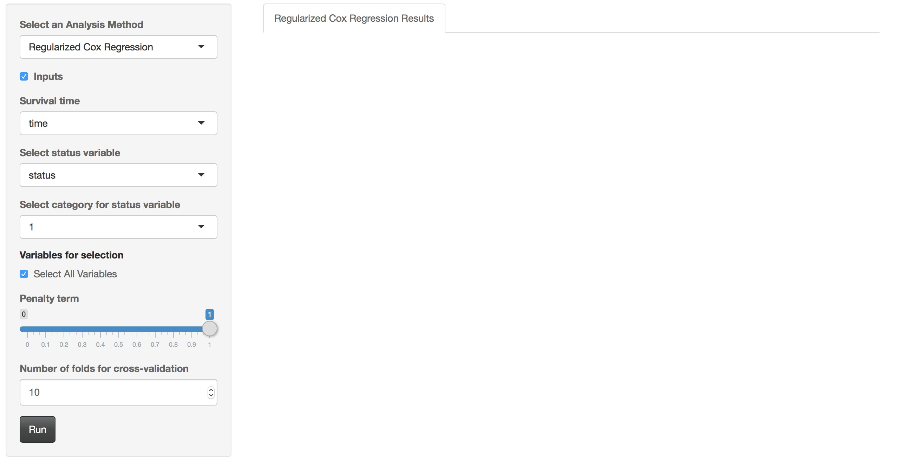
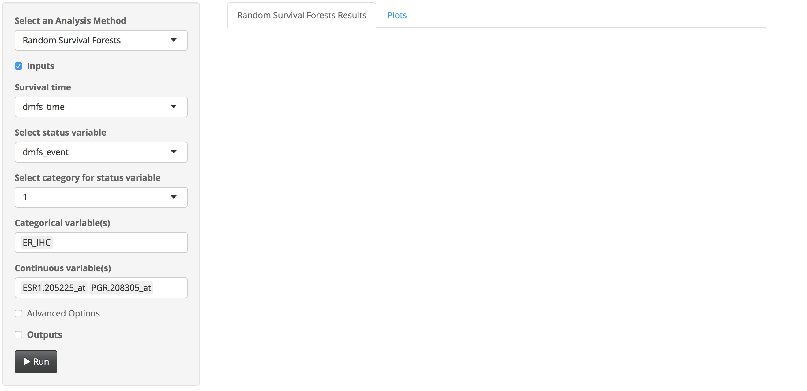

```{r setup, include=FALSE}
knitr::opts_chunk$set(echo = TRUE)
```

## Abstract

Survival analysis is described as collection of statistical methods for which the response variable of interest is time until an event occurs. In this context, the time can be days, week, months and years from the beginning of follow-up of an individual until an event occurs, or the age of an individual when the event occurs. Moreover, the event can be death, disease, remission, recovery or any experience of interest that may occur to an individual. A more detailed information can be found in Kleinbaum and Marubini and Valsecchi.

Here we developed an easy-to-use, up-to-date, comprehensive and interactive web-based tool for survival analysis. This tool includes analysis procedures for life table, Kaplan-Meier and Cox regression. Each procedure includes following features:

Life table: descriptive statistics, life table, median life time, hazard ratios and comparison tests including Log-rank, Gehan-Breslow, Tarone-Ware, Peto-Peto, Modified Peto-Peto, Flemington-Harrington.

Kaplan-Meier: descriptive statistics, survival table, mean and median life time, hazard ratios, comparison tests including Log-rank, Gehan-Breslow, Tarone-Ware, Peto-Peto, Modified Peto-Peto, Flemington-Harrington, and interactive plots such as Kaplan-Meier curves and hazard plots.

Cox regression: coefficient estimates, hazard ratios, goodness of fit test, analysis of deviance, save predictions, save residuals, save Martingale residuals, save Schoenfeld residuals, save dfBetas, proportional hazard assumption test, and interactive plots including Schoenfeld residual plot and Log-Minus-Log plot.

Regularized Cox regression: variable selection and coefficient estimations using ridge, elastic net and lasso penalties.

Random survival forests: individual survival and cumulative hazard predictions using random survival forests, and interactive plots including, survival (with OOB), hazard (with OOB), error rate vs number of tree and cox regression vs random survival forest model. 

## 1.Data upload

This tool requires a dataset in `*.txt` format, which is seperated by `comma`, `semicolon`, `space` or `tab` delimiter. First row of dataset must include header. When the appropriate file is uploaded, the dataset will be appear immediately on the main page of the tool. Alternatively users can upload one of the example datasets provided within the tool for testing and understanding the operating logic of the tool.    




## 2. Analysis Methods

### 2.1. Life Table

#### Concept

Life tables has been widely used in actuarial science where demographic predictions are made. This method is used to estimate the survival probabilities and hazard ratios for a cohort group, which is followed-up for a certain time period. It usually applies to cross-sectional data from a large population. For more detailed information please see <a href ="http://onlinelibrary.wiley.com/book/10.1002/0471272612" target = "_blank" > Newman (2003)</a>.    


#### Variables

* `Survival time`: Time until an event occurs (i.e. days, weeks, months, years)
* `Status variable`: The event (i.e. death, disease, remission, recovery)
* `Category value for status variable`: Category value of the event of interest (i.e. 1, yes)
* `Factor variable`: A categorical variable which indicates different study groups (i.e. treatment, gender)

#### Usage

A life table can be constructed for a cohort group using the following steps: 

1. Select the analysis method as `Life Table` from `Analysis` tab.
2. Select suitable variables for the analysis, such as `survival time`, `status variable`, `category value for status variable` and `factor variable`, if exists.
3. Define an appropriate time interval from beginning to end of study by a specific step.
4. In advanced options, one can change `confidence interval type` as log, log-log or plain, `variance estimation method` as Greenwood or Tsiatis and `reference category` as first or last.
5. Click `Run` button to run the analysis.


#### Outputs
*Desired outputs can be selected by clicking Outputs checkbox. Available outputs are;* 


```{r lifeTable, echo=FALSE, eval = TRUE, message=FALSE, warning=FALSE, include=FALSE}
setwd("~/Dropbox/GSD/Studies/Web-Tools(Devel)/compSurv/")

library("survival")
library("KMsurv")
library("survMisc")
source("lifeTables.R")

data <- read.table("www/data/bladderCancer.txt", header=TRUE, sep = "\t")

lt = lifeTables(survivalTime = "time", statusVariable = "status", status = 1, factors= "group", fromTime = 0, toTime = 60, by = 10, lifeTable = TRUE, descriptives = TRUE, hr = TRUE, medianLifeTime = TRUE, data = data)
```


##### a. Case summary

Descriptive statistics, sample size (`n`), number of event (`n of event`), percent of event (`% of event`), number of censored cases (`n of censor`) and percent of censored cases (`% of censor`), can be obtained. 


```{r lifeTableDescriptives, echo=FALSE, eval = TRUE, message=FALSE, warning=FALSE, include=TRUE}
      desc = lt$tableResult$caseSummary
      descs = do.call(rbind.data.frame, desc)
      DT::datatable(descs, extensions = c('Buttons','KeyTable', 'Responsive'), options = list(
  dom = 'Bfrtip',
  buttons = c('copy', 'csv', 'excel', 'pdf', 'print'), keys = TRUE
     ))
```


#####b. Life table

A life table can be created. First column in the table represents factor group and number of interval (i.e. 1.2 means second time interval in the first factor group, likewise 2.1 means first time interval in the second group). Second column is `interval time`, third column gives number of subjects at the beginning of the  time interval, fourth column is the number of withdraws at the beginning of the  time interval, fifth column represents the number of subjects at risk at the beginning of the  time interval, sixth column is the number of events at the beginning of the  time interval, seventh column is the probability of terminating during the time interval, eighth column is the probability of surviving in the time interval and nineth column is the cumulative probability of surviving at the beginning of the time interval.  

```{r lifeTable2, echo=FALSE, eval = TRUE, message=FALSE, warning=FALSE}
     ltResult = lt$testResult$lifeTable
     ltResults = do.call(rbind.data.frame, ltResult)

      DT::datatable(ltResults, extensions = c('Buttons','KeyTable', 'Responsive'), options = list(
  dom = 'Bfrtip',
  buttons = c('copy', 'csv', 'excel', 'pdf', 'print'), keys = TRUE
     ))
```


#####c. Median life time

Median life time can be calculated for each factor group. 

```{r medianLifeTime, echo=FALSE, eval = TRUE, message=FALSE, warning=FALSE}
     mlt = lt$tableResult$medianLifeTime
     mltResults = do.call(rbind.data.frame, mlt)

      DT::datatable(mltResults, extensions = c('Buttons','KeyTable', 'Responsive'), options = list(
  dom = 'Bfrtip',
  buttons = c('copy', 'csv', 'excel', 'pdf', 'print'), keys = TRUE
     ))
```


#####d. Hazard ratio

Hazard ratios can be computed for each factor group and for each time interval. First and second columns are interpreted as in the life table. Third column gives the hazard ratios for each time interval in each factor group, while fourth column gives the respective standard errors for each hazard ratio estimation. Fifth and sixth columns represents the lower and the upper limits for each hazard ratio estimation for each time interval in each factor group.

```{r hazardRatioLifeTable, echo=FALSE, eval = TRUE, message=FALSE, warning=FALSE}
     hrResult = lt$testResult$hazardRatio
     hrResults = do.call(rbind.data.frame, hrResult)

      DT::datatable(hrResults, extensions = c('Buttons','KeyTable', 'Responsive'), options = list(
  dom = 'Bfrtip',
  buttons = c('copy', 'csv', 'excel', 'pdf', 'print'), keys = TRUE
     ))
```


#####e. Comparison tests

Six different comparison tests can be calculated for testing the differences in survival probability estimations between factor groups. 

```{r comparisonTestsLifeTable, echo=FALSE, eval = TRUE, message=FALSE, warning=FALSE}
     compTestResult = lt$testResult$testResults

      DT::datatable(compTestResult, extensions = c('Buttons','KeyTable', 'Responsive'), options = list(
  dom = 'Bfrtip',
  buttons = c('copy', 'csv', 'excel', 'pdf', 'print'), keys = TRUE
     ))
```


### 2.2. Kaplan-Meier

#### Concept

Kaplan-Meier is a non-paranetric statistical method that is used to estimate survival probabilities and hazard ratios for a cohort study group. In clinical trials, it is often used to measure the part of patients living for a certain period of time after a treatment. 


#### Variables
* `Survival time`: Time until an event occurs (i.e. days, weeks, months, years)
* `Status variable`: The event (i.e. death, disease, remission, recovery)
* `Category value for status variable`: Category value of the event of interest (i.e. 1, yes)
* `Factor variable`: A categorical variable which indicates different study groups (i.e. treatment, gender)

#### Usage

A Kaplan-Meier analysis can be conducted by applying the following steps: 

1. Select the analysis method as `Kaplan Meier` from `Analysis` tab.
2. Select suitable variables for the analysis, such as `survival time`, `status variable`, `category value for status variable` and `factor variable`, if exists.
3. In advanced options, one can change confidence interval type, as log, log-log or plain, variance estimation method, as Greenwood or Tsiatis, comparison test type, as Log-rank, Gehan-Breslow, Tarone-Ware, Peto-Peto, Modified Peto-Peto or Flemington-Harrington, confidence level and reference category, as first or last.
4. Click `Run` button to run the analysis.




#### Outputs
*Desired outputs can be selected by clicking Outputs checkbox. Available outputs are;* 


```{r kaplanMeier, echo=FALSE, eval = TRUE, message=FALSE, warning=FALSE, include=FALSE}
setwd("~/Dropbox/GSD/Studies/Web-Tools(Devel)/compSurv/")

library("survival")
library("KMsurv")
library("survMisc")
source("kaplanMeier.R")
library("highcharter")

data <- read.table("www/data/bladderCancer.txt", header=TRUE, sep = "\t")

km = kaplanMeier (survivalTime = "time", statusVariable = "status", status = 1, factors= "group", survivalTable = TRUE, data = data)

```


#####a. Case summary

Summary statistics, such as number and percent of observations, events and censored cases can be obtained. 

```{r kaplanMeierDescriptives, echo=FALSE, eval = TRUE, message=FALSE, warning=FALSE, include=TRUE}
      desc = km$tableResult$caseSummary
      descs = do.call(rbind.data.frame, desc)
      DT::datatable(descs, extensions = c('Buttons','KeyTable', 'Responsive'), options = list(
  dom = 'Bfrtip',
  buttons = c('copy', 'csv', 'excel', 'pdf', 'print'), keys = TRUE
     ))
```


*

#####b. Survival table

A survival table can be created. First column in the table represents factor group and number of time points (i.e. 1.2 means second time point in the first factor group, likewise 2.1 means first time point in the second group). Second column is survival time, third column gives number of subjects at risk, fourth column is the number of events, fifth column represents the cumulative probability of surviving, sixth, seventh and eight columns are associated standard error, lower and upper limits, respectively. 

```{r kaplanMeier2, echo=FALSE, eval = TRUE, message=FALSE, warning=FALSE}
    stResult = km$testResult$survivalTable
    stResults = do.call(rbind.data.frame, stResult)

      DT::datatable(stResults, extensions = c('Buttons','KeyTable', 'Responsive'), options = list(dom = 'Bfrtip',buttons = c('copy', 'csv', 'excel', 'pdf', 'print'), keys = TRUE
     ))
```


#####c. Survival plot

A forest plot can be created for each level of factor group using survival probabilites at each end point. 

```{r survivalPlot, echo=FALSE, eval = TRUE, message=FALSE, warning=FALSE}
  surv = km$testResult$survivalTable[[names(km$testResult$hazardRatio)[1]]]

    highchart() %>% hc_exporting(enabled = TRUE, filename = "survivalPlot") %>% 
      hc_add_series(name = "Survival", type = "line", data = surv$`Cumulative probability of surviving`, showInLegend = FALSE, zIndex = 1, marker = list(lineColor = "black", lineWidth = 1), lineWidth = 0, id = "survival") %>%
      hc_add_series(name = "CI", data = as.matrix(cbind(surv$`Lower limit`, surv$`Upper limit`)),type = "errorbar", names = "Limits", showInLegend = FALSE, zIndex = 0, lineWidth = 1.5, linkedTo = "survival") %>%
      hc_chart(zoomType = "xy", inverted = TRUE) %>%
      hc_xAxis(categories = as.character(surv$Time), title = list(text = "Time")) %>%
      hc_yAxis(startOnTick = FALSE, endOnTick = FALSE, title = list(text = "Survival")) %>%
      #hc_plotOptions(tooltip = list(headerFormat = "<b>Time: </b>{point.x}")) %>%
      hc_tooltip(crosshairs = TRUE, shared = TRUE, headerFormat = "<b>Time: </b>{point.x} <br>") %>%
      hc_plotOptions(line = list(tooltip = list(pointFormat = "<b>{series.name}: </b>{point.y:.3f} ")), 
                     errorbar = list(tooltip = list(pointFormat = "({point.low} - {point.high})"))) %>%
      hc_add_theme(hc_theme_google())
```


*

#####d. Mean and Median life time

Mean and median life time and their associated confidence levels can be calculated for each level of factor group. 

```{r medianAndMedianLifeTime, echo=FALSE, eval = TRUE, message=FALSE, warning=FALSE}
     mst = km$tableResult$meanMedianSurvivalTimes
      rownames(mst) = mst$Factor
        mstResults =  mst[-1]


      DT::datatable(mstResults, extensions = c('Buttons','KeyTable', 'Responsive'), options = list(
  dom = 'Bfrtip',
  buttons = c('copy', 'csv', 'excel', 'pdf', 'print'), keys = TRUE
     ))
```


*

#####e. Hazard ratio

Hazard ratios and their respective lower and upper limits can be calculated for each factor group at each end point. 


```{r hazardRatioKaplanMeier, echo=FALSE, eval = TRUE, message=FALSE, warning=FALSE}
     hrResult = km$testResult$hazardRatio
     hrResults = do.call(rbind.data.frame, hrResult)

      DT::datatable(hrResults, extensions = c('Buttons','KeyTable', 'Responsive'), options = list(
  dom = 'Bfrtip',
  buttons = c('copy', 'csv', 'excel', 'pdf', 'print'), keys = TRUE
     ))
```


*

#####f. Hazard plot

A forest plot can be created for each level of factor group using hazard ratios at each end point. 


```{r hazardPlot, echo=FALSE, eval = TRUE, message=FALSE, warning=FALSE}
    
    hazard = km$testResult$hazardRatio[[names(km$testResult$hazardRatio)[1]]]

    highchart() %>% hc_exporting(enabled = TRUE, filename = "hazardPlot") %>% 
      hc_add_series(name = "Hazard", type = "line", data = hazard$Hazard.Ratio, showInLegend = FALSE, zIndex = 1, marker = list(lineColor = "black", lineWidth = 1), lineWidth = 0, id = "hazard") %>%
      hc_add_series(name = "CI", data = as.matrix(cbind(hazard$Lower, hazard$Upper)),type = "errorbar", names = "Limits", showInLegend = FALSE, zIndex = 0, lineWidth = 1.5, linkedTo = "hazard") %>%
      hc_chart(zoomType = "xy", inverted = TRUE) %>%
      hc_xAxis(categories = as.character(hazard$Time), title = list(text = "Time")) %>%
      hc_yAxis(startOnTick = FALSE, endOnTick = FALSE, title = list(text = "Hazard Ratio")) %>%
      #hc_plotOptions(tooltip = list(headerFormat = "<b>Time: </b>{point.x}")) %>%
      hc_tooltip(crosshairs = TRUE, shared = TRUE, headerFormat = "<b>Time: </b>{point.x} <br>") %>%
      hc_plotOptions(line = list(tooltip = list(pointFormat = "<b>{series.name}: </b>{point.y:.3f} ")), 
                     errorbar = list(tooltip = list(pointFormat = "({point.low} - {point.high})"))) %>%
      hc_add_theme(hc_theme_google())
```


#####g. Comparison tests

Six different comparison tests can be calculated for testing the differences in survival probability estimations between factor groups. 


```{r comparisonTestsKaplanMeier, echo=FALSE, eval = TRUE, message=FALSE, warning=FALSE}
      
      compTestResult = km$testResult$testResults
      DT::datatable(compTestResult, extensions = c('Buttons','KeyTable', 'Responsive'), options = list(
                    dom = 'Bfrtip', buttons = c('copy', 'csv', 'excel', 'pdf', 'print'), keys = TRUE))
```


*

#####h. Plots


```{r coxPlots, echo=FALSE, eval = TRUE, message=FALSE, warning=FALSE, include=FALSE}

data <- read.table("www/data/bladderCancer.txt", header=TRUE, sep = "\t")

km = kaplanMeier (survivalTime = "time", statusVariable = "status", status = 1, factors= "group", survivalTable = TRUE, data = data)


    survivalTime = "time"
    statusVariable = "status"
    status = 1
    fctr = "group"
    

    ci = "log"
    varianceEstimation = "greenwood"
    confidenceLevel = 95
    factors = fctr


    if(!is.null(survivalTime)){
        survivalTime = as.matrix(data[, survivalTime, drop = FALSE])
    }

    if(!is.null(factors)){
        factors = as.factor(data[, factors])
    }

    if(!is.null(factors)){
        factorsName = data[, factors, drop = FALSE]
    }

    if(!is.null(statusVariable)){
        statusVariable = data[, statusVariable]
        
    }

    if(!is.null(status)){
        if(is.numeric(status)){status = as.numeric(status)}else{status = as.factor(status)}
    }

    if(!is.null(factors)){
        newData = data.frame(id =seq(1,dim(survivalTime)[1], 1), survivalTime= survivalTime,
        statusVar=statusVariable,factor = factors)
        newData = newData[complete.cases(newData),]
        colnames(newData) = c("id","time","statusVar", "factor")
        
    }else{
        
        newData = data.frame(id =seq(1,dim(survivalTime)[1], 1), survivalTime= survivalTime,
        statusVar=statusVariable)
        newData = newData[complete.cases(newData),]
        colnames(newData) = c("id", "time", "statusVar")
        
    }

        newData$statusVar = newData$statusVar%in%status


    #data[,input$survivalTimeKM] = as.numeric(data[,input$survivalTimeKM])
    #data[,input$factorVarKM] = as.factor(data[,input$factorVarKM])


    if(!is.null(fctr)){
        compareCurves <- survfit(Surv(time, statusVar == TRUE) ~ factors, data = newData, conf.type = ci, error = varianceEstimation, conf.int = confidenceLevel/100)
    

        for(i in 1:length(names(compareCurves$strata))) {
          
            names(compareCurves$strata)[i] = gsub("factors", "group", names(compareCurves$strata)[i])
          
        }


    }else{
        compareCurves <- survfit(Surv(time, statusVar == TRUE) ~ 1, data = newData, conf.type = ci, error = varianceEstimation, conf.int = confidenceLevel/100)
    }

  enabledLegend = TRUE
  is.even <- function(x) x %% 2 == 0
  ranges = TRUE
```
  

##### i. Kaplan-Meier curve
  
Kaplan-Meier curves can be created. A number of edit options is also available for plots.   
  
```{r kmPlots, echo=FALSE, eval = TRUE, message=FALSE, warning=FALSE}
  
 p =  hchart(compareCurves, ranges = ranges, type = "line", markTimes = TRUE, 
                 animation = TRUE) 

p %>% hc_title(text = "Kaplan-Meier Plot") %>%  
      hc_xAxis(title = list(text = "Time"), tickInterval=NULL, tickLength = 5, lineWidth = 1)  %>%  
      hc_yAxis(title = list(text = "Survival Probability"), lineWidth = 1, tickLength = 5, tickWidth= 1, labels = list(format = "{value:.2f}")) %>% 
      #hc_colors("#440154") %>%
      hc_add_theme(hc_theme_gridlight()) %>%
      hc_chart(backgroundColor = "white", zoomType = "xy") %>% 
      hc_legend(enabled = TRUE) %>% 
      hc_plotOptions(line = list(dashStyle = "Solid"), area = list(zIndex = 15), series = list(enableMouseTracking = TRUE)) %>% 
      hc_tooltip(shared = TRUE, crosshairs = TRUE, valueDecimals = 3, followTouchMove = FALSE, headerFormat = "<b>Time</b>: {point.key} <br>")#, pointFormat = "{series.name}: {point.y}")
  


```


##### j. Hazard plot

Hazard plot can be created. A number of edit options is also available for plots.   

  
```{r hazardPlots, echo=FALSE, eval = TRUE, message=FALSE, warning=FALSE}
  

  p <- hchart(compareCurves, fun = "cumhaz", ranges = ranges, type = "line", markTimes = TRUE, 
                 animation = TRUE) 


p %>% hc_title(text = "Hazard Plot") %>%  
      hc_xAxis(title = list(text = "Time"), tickInterval=NULL, tickLength = 5, lineWidth = 1)  %>%  
      hc_yAxis(title = list(text = "Cumulative Hazard"), lineWidth = 1, tickLength = 5, tickWidth= 1, labels = list(format = "{value:.2f}")) %>% 
      #hc_colors("#440154") %>%
      hc_add_theme(hc_theme_gridlight()) %>%
      hc_chart(backgroundColor = "white", zoomType = "xy") %>% 
      hc_legend(enabled = TRUE) %>% 
      hc_plotOptions(line = list(dashStyle = "Solid"), area = list(zIndex = 15), series = list(enableMouseTracking = TRUE)) %>% 
      hc_tooltip(shared = TRUE, crosshairs = TRUE, valueDecimals = 3, followTouchMove = FALSE, headerFormat = "<b>Time</b>: {point.key} <br>")#, pointFormat = "{series.name}: {point.y}")
  
```


##### k. Log-Minus-Log plot

Log-Minus-Log plot can be created. A number of edit options is also available for plots.   
  
```{r lmlPlots, echo=FALSE, eval = TRUE, message=FALSE, warning=FALSE}
  

  p <- hchart(compareCurves, fun = "cloglog", ranges = ranges, type = "line", markTimes = TRUE, 
                 animation = TRUE) 

p %>% hc_title(text = "Log-Minus-Log Plot") %>%  
      hc_xAxis(title = list(text = "Time"), tickInterval=NULL, tickLength = 5, lineWidth = 1)  %>%  
      hc_yAxis(title = list(text = "log(-log(survival))"), lineWidth = 1, tickLength = 5, tickWidth= 1, labels = list(format = "{value:.2f}")) %>% 
      #hc_colors("#440154") %>%
      hc_add_theme(hc_theme_gridlight()) %>%
      hc_chart(backgroundColor = "white", zoomType = "xy") %>% 
      hc_legend(enabled = TRUE) %>% 
      hc_plotOptions(line = list(dashStyle = "Solid"), area = list(zIndex = 15), series = list(enableMouseTracking = TRUE)) %>% 
      hc_tooltip(shared = TRUE, crosshairs = TRUE, valueDecimals = 3, followTouchMove = FALSE, headerFormat = "<b>Time</b>: {point.key} <br>")#, pointFormat = "{series.name}: {point.y}")
  
```


### 2.3. Cox Regression
  
#### Concept

Cox regression, also known as proportional hazard regression, is a method to investigate the effect of one or multiple factors upon the time an event of interest occurs. In this model, the effect of a unit increase in a factor is multiplicative with respect to the hazard rate.

#### Usage  
  
A Cox regression analysis can be conducted by applying the following steps:

1. Select the analysis method as `Cox Regression` from `Analysis` tab.
2. Select suitable variables for the analysis, such as `survival time`, `status variable`, `category value for status variable`, and categorical and continuous predictors for the model.
3. In advanced options, `interaction terms`, `strata terms` and `time dependent covariates` can be added to the model. Moreover, if there are multiple records for observations, users can specify it by clicking `Multiple ID` checkbox. Furthermore, once can choose model selection criteria, as `AIC` or `p-value`, model selection method, as `backward`, `forward` or `stepwise`, reference category, as `first` or `last`, and ties method, as `Efron`, `Breslow` or `exact` and change the `confidence level`.  
4. Click `Run` button to run the analysis.




#### Outputs

Desired outputs can be selected by clicking Outputs checkbox. Available outputs are coefficient estimates, hazard ratio, goodness of fit tests, analysis of deviance, predictions, residuals, Martingale residuals, Schoenfeld residuals and DfBetas.


```{r coxRegression, echo=FALSE, eval = TRUE, message=FALSE, warning=FALSE, include=FALSE}
setwd("~/Dropbox/GSD/Studies/Web-Tools(Devel)/compSurv/")

    library("DT")
    library("survival")
    library("KMsurv")
    library("survMisc")
    source("coxRegression.R")
    source("getDescriptiveResultsCoxRegression.R")
    source("stepwise.R")
    source("plotLT.R")
    require("ggplot2")
    source("ggsurv.R")
    source("ggsurv2.R")
    source("plotSchoenfeld.R")
    library("magrittr")
    library("dplyr")
    library("survminer")
    library("highcharter")

data <- read.table("www/data/brainCancer.txt", header=TRUE, sep = "\t")

 cox = coxRegression(survivalTime = "time", categoricalInput = "group", continuousInput = "age",                                statusVariable = "status", status = 1, displayDescriptives = TRUE,                                        displayCoefficientEstimates = TRUE, displayModelFit = TRUE, hazardRatio = TRUE,                            goodnessOfFitTests = TRUE, analysisOfDeviance = TRUE, ties = "efron", data = data)  

```


#####a. Coefficient Estimates 

A coefficient estimation table, which includes variable names, coefficient estimates and their associated standard errors, z statistics and p values, can be created.   

```{r displayCoefficientEstimatesResults, echo=FALSE, eval = TRUE, message=FALSE, warning=FALSE}

    coeffResultsCox = cox$testResult$displayCoefficientEstimatesResults
    DT::datatable(coeffResultsCox, extensions = c('Buttons','KeyTable', 'Responsive'), options = list(
                  dom = 'Bfrtip', buttons = c('copy', 'csv', 'excel', 'pdf', 'print'), keys = TRUE))
```


#####b. Hazard ratio 

A hazard ratio table, which includes variable names, hazard ratios and their associated lower and upper limits, can be created.  


```{r hazardRatioReactiveCox, echo=FALSE, eval = TRUE, message=FALSE, warning=FALSE}

    hrResultsCox = cox$testResult$hazardRatioResults

      DT::datatable(hrResultsCox, extensions = c('Buttons','KeyTable', 'Responsive'), options = list(
  dom = 'Bfrtip',
  buttons = c('copy', 'csv', 'excel', 'pdf', 'print'), keys = TRUE
     ))
```


#####c. Hazard plot 

A forest plot can be created for hazard ratios to give them a visual inpection.

```{r hazardPlotCox, echo=FALSE, eval = TRUE, message=FALSE, warning=FALSE}

          cox = cox$testResult$hazardRatioResults

          if(nrow(cox)>1){
    
            cox = cbind.data.frame("Variable" = levels(cox$Variable), apply(cox[,-1],2, as.numeric))
    
           }else{

            cox = cbind.data.frame("Variable" = levels(cox$Variable), as.data.frame(t(apply(cox[,-1],2, as.numeric))))

           }   

         highchart() %>% hc_exporting(enabled = TRUE, filename = "hazardPlot") %>% 
          hc_add_series(name = "Hazard", type = "line", data = cox$`Hazard ratio`, showInLegend = FALSE, zIndex = 1, marker = list(lineColor = "black", lineWidth = 1), lineWidth = 0, id = "hazard") %>%
          hc_add_series(name = "CI", data = as.matrix(cbind(cox$`Lower limit (95%)`, cox$`Upper limit (95%)`)),type = "errorbar", names = "Limits", showInLegend = FALSE, zIndex = 0, lineWidth = 1.5, linkedTo = "hazard") %>%
          hc_chart(zoomType = "xy", inverted = TRUE) %>%
          hc_xAxis(categories = matrix(cox$Variable, ncol = 1)) %>%
          hc_yAxis(startOnTick = FALSE, endOnTick = FALSE, title = list(text = "Hazard Ratio"), plotLines = list(list(value = 1, width = 2, color = "green", dashStyle = "Dash"))) %>%
          #hc_plotOptions(tooltip = list(headerFormat = "<b>Time: </b>{point.x}")) %>%
          hc_tooltip(crosshairs = TRUE, shared = TRUE, headerFormat = "<b>Variable: </b>{point.x} <br>") %>%
          hc_plotOptions(line = list(tooltip = list(pointFormat = "<b>{series.name}: </b>{point.y:.3f} ")), 
                         errorbar = list(tooltip = list(pointFormat = "({point.low} - {point.high})"))) %>%
          hc_add_theme(hc_theme_google())
```


#####d. Goodness of Fit Tests

Fitted Cox regression model can be tested with three tests: Likelihood ratio, Wald, Score.

```{r goodnessOfFitTestsCoxsss, echo=FALSE, eval = TRUE, message=FALSE, warning=FALSE}


data <- read.table("www/data/brainCancer.txt", header=TRUE, sep = "\t")

 cox = coxRegression(survivalTime = "time", categoricalInput = "group", continuousInput = "age",                                statusVariable = "status", status = 1, displayDescriptives = TRUE,                                        displayCoefficientEstimates = TRUE, displayModelFit = TRUE, hazardRatio = TRUE,                            goodnessOfFitTests = TRUE, analysisOfDeviance = TRUE, ties = "efron", data = data)  

        goodnessOfFit = cox$testResult$goodnessOfFitTestsResults

 datatable(goodnessOfFit, rownames=FALSE, extensions = c('Buttons','KeyTable', 'Responsive'), options = list(dom = 'Bfrtip', buttons = c('copy', 'csv', 'excel', 'pdf', 'print'), keys = TRUE))
 
```


#####e. Analysis of Deviance

A deviance analysis can be conducted for each variable in the fitted model.

```{r analysisOfDevianceCox, echo=FALSE, eval = TRUE, message=FALSE, warning=FALSE}


data <- read.table("www/data/brainCancer.txt", header=TRUE, sep = "\t")

 cox = coxRegression(survivalTime = "time", categoricalInput = "group", continuousInput = "age",                                statusVariable = "status", status = 1, displayDescriptives = TRUE,                                        displayCoefficientEstimates = TRUE, displayModelFit = TRUE, hazardRatio = TRUE,                            goodnessOfFitTests = TRUE, analysisOfDeviance = TRUE, ties = "efron", data = data)  

        aod = cox$testResult$analysisOfDevianceResults

 datatable(aod, rownames=FALSE, extensions = c('Buttons','KeyTable', 'Responsive'), options = list(dom = 'Bfrtip', buttons = c('copy', 'csv', 'excel', 'pdf', 'print'), keys = TRUE))
 
```


#####f. Predictions

Predictions from the fitted model can be obtained.

```{r storePredictionsCox, echo=FALSE, eval = TRUE, message=FALSE, warning=FALSE}


data <- read.table("www/data/brainCancer.txt", header=TRUE, sep = "\t")

 cox = coxRegression(survivalTime = "time", categoricalInput = "group", continuousInput = "age",                                statusVariable = "status", status = 1, displayDescriptives = TRUE,                                        displayCoefficientEstimates = TRUE, displayModelFit = TRUE, hazardRatio = TRUE,                            goodnessOfFitTests = TRUE, analysisOfDeviance = TRUE, storePredictions = TRUE, ties = "efron", data = data)  

        preds = cox$testResult$Store$Predictions

 datatable(preds, rownames=TRUE, extensions = c('Buttons','KeyTable', 'Responsive'), options = list(dom = 'Bfrtip', buttons = c('copy', 'csv', 'excel', 'pdf', 'print'), keys = TRUE))
 
```


#####g. Residuals

Residuals from the fitted model can be obtained.


```{r storeResidualsCox, echo=FALSE, eval = TRUE, message=FALSE, warning=FALSE}


data <- read.table("www/data/brainCancer.txt", header=TRUE, sep = "\t")

 cox = coxRegression(survivalTime = "time", categoricalInput = "group", continuousInput = "age",                                statusVariable = "status", status = 1, displayDescriptives = TRUE,                                        displayCoefficientEstimates = TRUE, displayModelFit = TRUE, hazardRatio = TRUE,                            goodnessOfFitTests = TRUE, analysisOfDeviance = TRUE, storeResiduals = TRUE, ties = "efron", data = data)  

        residuals = cox$testResult$Store$Residuals

 datatable(residuals, rownames=TRUE, extensions = c('Buttons','KeyTable', 'Responsive'), options = list(dom = 'Bfrtip', buttons = c('copy', 'csv', 'excel', 'pdf', 'print'), keys = TRUE))
 
```


#####h. Martingale Residuals

Martingale residuals from the fitted model can be obtained.

```{r storeMartingaleResidualsCox, echo=FALSE, eval = TRUE, message=FALSE, warning=FALSE}


data <- read.table("www/data/brainCancer.txt", header=TRUE, sep = "\t")

 cox = coxRegression(survivalTime = "time", categoricalInput = "group", continuousInput = "age",                                statusVariable = "status", status = 1, displayDescriptives = TRUE,                                        displayCoefficientEstimates = TRUE, displayModelFit = TRUE, hazardRatio = TRUE,                            goodnessOfFitTests = TRUE, analysisOfDeviance = TRUE, storeMartingaleResiduals = TRUE, ties = "efron", data = data)  

        martingaleResiduals = cox$testResult$Store$MartingaleResiduals

 datatable(martingaleResiduals, rownames=TRUE, extensions = c('Buttons','KeyTable', 'Responsive'), options = list(dom = 'Bfrtip', buttons = c('copy', 'csv', 'excel', 'pdf', 'print'), keys = TRUE))
 
```


#####i. Schoenfeld Residuals

Schoenfeld residuals from the fitted model can be obtained.

```{r storeSchoenfeldResidualsCox, echo=FALSE, eval = TRUE, message=FALSE, warning=FALSE}


data <- read.table("www/data/brainCancer.txt", header=TRUE, sep = "\t")

 cox = coxRegression(survivalTime = "time", categoricalInput = "group", continuousInput = "age",                                statusVariable = "status", status = 1, displayDescriptives = TRUE,                                        displayCoefficientEstimates = TRUE, displayModelFit = TRUE, hazardRatio = TRUE,                            goodnessOfFitTests = TRUE, analysisOfDeviance = TRUE, storeSchoenfeldResiduals = TRUE, ties = "efron", data = data)  

        storeSchoenfeldResiduals = cox$testResult$Store$SchoenfeldResiduals

 datatable(storeSchoenfeldResiduals, rownames=TRUE, extensions = c('Buttons','KeyTable', 'Responsive'), options = list(dom = 'Bfrtip', buttons = c('copy', 'csv', 'excel', 'pdf', 'print'), keys = TRUE))
 
```


#####j. DfBetas

DfBetas residuals from the fitted model can be obtained.


```{r storeDfBetasCox, echo=FALSE, eval = TRUE, message=FALSE, warning=FALSE}


data <- read.table("www/data/brainCancer.txt", header=TRUE, sep = "\t")

 cox = coxRegression(survivalTime = "time", categoricalInput = "group", continuousInput = "age",                                statusVariable = "status", status = 1, displayDescriptives = TRUE,                                        displayCoefficientEstimates = TRUE, displayModelFit = TRUE, hazardRatio = TRUE,                            goodnessOfFitTests = TRUE, analysisOfDeviance = TRUE, storeDfBetas = TRUE, ties = "efron", data = data)  

        DfBetas = cox$testResult$Store$DfBetas

 datatable(DfBetas, rownames=TRUE, extensions = c('Buttons','KeyTable', 'Responsive'), options = list(dom = 'Bfrtip', buttons = c('copy', 'csv', 'excel', 'pdf', 'print'), keys = TRUE))
 
```


#####k. Proportional Hazard Test

To check the proportionality assumption of Cox regression model, a proportional hazard test can be conducted both globally and for each variable in the fitted model. 

```{r phTest, echo=FALSE, eval = TRUE, message=FALSE, warning=FALSE}


data <- read.table("www/data/brainCancer.txt", header=TRUE, sep = "\t")

 cox = coxRegression(survivalTime = "time", categoricalInput = "group", continuousInput = "age",                                statusVariable = "status", status = 1, displayDescriptives = TRUE,                                        displayCoefficientEstimates = TRUE, displayModelFit = TRUE, hazardRatio = TRUE,                            goodnessOfFitTests = TRUE, analysisOfDeviance = TRUE, storeDfBetas = TRUE, ties = "efron", data = data)  

        coxPhTest = cox$testResult$displayCoxPh

 datatable(coxPhTest, rownames=TRUE, extensions = c('Buttons','KeyTable', 'Responsive'), options = list(dom = 'Bfrtip', buttons = c('copy', 'csv', 'excel', 'pdf', 'print'), keys = TRUE))
 
```


#####l. Schoenfeld Plot

Beside a formal test for proportionality assumption, a Schoenfeld plot can be created to check the assumption visually.

```{r schoenfeldPlot, echo=FALSE, eval = TRUE, message=FALSE, warning=FALSE}

          compareCurves = cox$model
          x <- cox.zph(compareCurves, transform = 'rank')
    
          resid = TRUE
          se = TRUE
          df = 4
          nsmo = 40
          ltyest = "Solid"
          ltyci = "Solid"
          col = 1
          colorLine = "#204BD9"
          colorLineCI = "#59A819"

          lwd=1

          lty = ltyest
          xx <- x$x
          yy <- x$y
          d <- nrow(yy)
          df <- max(df)     
          nvar <- ncol(yy)
          pred.x <- seq(from=min(xx), to=max(xx), length=nsmo)
          temp <- c(pred.x, xx)
          lmat <- splines::ns(temp, df=df, intercept=TRUE)
          pmat <- lmat[1:nsmo,]       
          xmat <- lmat[-(1:nsmo),]
          qmat <- qr(xmat)
          yvar = x$y
          var = ncol(yvar)
    
          if (qmat$rank < df) {stop("Spline fit is singular, try a smaller degrees of freedom")}
    
          if (se) {
            bk <- backsolve(qmat$qr[1:df, 1:df], diag(df))
            xtx <- bk %*% t(bk)
            seval <- d*((pmat%*% xtx) *pmat) %*% rep(1, df)
          }
    
          if (missing(var)) {var <- 1:nvar}else {
            if (is.character(var)) {var <- match(var, dimnames(yy)[[2]])}
            if  (any(is.na(var)) || max(var)>nvar || min(var) <1) {stop("Invalid variable requested")}
          }
    
          if (x$transform == 'log') {
            xx <- exp(xx)
            pred.x <- exp(pred.x)
          }
          if(x$transform != 'identity') {
            xtime <- as.numeric(dimnames(yy)[[1]])
            indx <- !duplicated(xx) 
            apr1  <- approx(xx[indx], xtime[indx], 
                            seq(min(xx), max(xx), length=17)[2*(1:8)])
            temp <- signif(apr1$y,2)
            apr2  <- approx(xtime[indx], xx[indx], temp)
            xaxisval <- apr2$y
            xaxislab <- rep("",8)
            for (i in 1:8) {xaxislab[i] <- format(temp[i])}
          }
    
          col <- rep(col, length=2)
          lwd <- rep(lwd, length=2)
          lty <- rep(lty, length=2)
    
    
          svar = "group1"
    
    
          for (i in 1:var) {
            y <- yy[,svar]
            yhat <- pmat %*% qr.coef(qmat, y)
            if (resid) {yr <-range(yhat, y)}else{yr <-range(yhat)}
            if (se) {
              temp <- 2* sqrt(x$var[i,i]*seval)
              yup <- yhat + temp
              ylow<- yhat - temp
              yr <- range(yr, yup, ylow)
              newData2 = cbind.data.frame(pred.x,yhat, yup, ylow) 

            }
            
            newData = cbind.data.frame(xx, y)
            newData3 = cbind.data.frame(pred.x, yhat)

            
           
           fn =  paste0("function() {\n if (this.value == ", xaxisval[1], ") {return ",xaxislab[1], "}\n  
                    if (this.value == ", xaxisval[2], ") {return ",xaxislab[2], "}\n
                    if (this.value == ", xaxisval[3], ") {return ",xaxislab[3], "}\n
                    if (this.value == ", xaxisval[4], ") {return ",xaxislab[4], "}\n
                    if (this.value == ", xaxisval[5], ") {return ",xaxislab[5], "}\n
                    if (this.value == ", xaxisval[6], ") {return ",xaxislab[6], "}\n
                    if (this.value == ", xaxisval[7], ") {return ",xaxislab[7], "}\n
                    if (this.value == ", xaxisval[8], ") {return ",xaxislab[8], "}\n
                   ", "}"
                  )
            
      
         ylabel =  paste0("Scaled Schoenfeld residuals for ", svar)
  

              sp = highchart() %>% 
                hc_add_series(name = "Curve", data = as.matrix(newData3), type = "line",  enabled = FALSE, color = "#204BD9", marker = list(enabled = FALSE), id = "schoenLine")%>%
                hc_xAxis(tickInterval=NULL, tickLength = 5, lineWidth = 1, tickPositions = xaxisval, labels = list(formatter = JS(fn), format = "{value:.2f}"), title = list(text = "Time"))%>%
                hc_yAxis(tickInterval=NULL, tickLength = 5, lineWidth = 1, title = list(text = ylabel), labels = list(format = "{value:.2f}"))%>% 
                hc_title(text = "Schoenfeld Plot") %>%
                hc_add_theme(hc_theme_google()) %>%
                hc_plotOptions(line = list(dashStyle = "Solid")) %>%
                hc_chart(backgroundColor = "#FFFFFF", zoomType = "xy") %>%
                hc_tooltip(shared = TRUE, crosshairs = FALSE, valueDecimals = 2, followTouchMove = FALSE)

          
              
              if (resid){
                sp = sp %>%  hc_add_series(name = "Residuals", data = as.matrix(newData), type="scatter",  labels = list(format = "{value:.2f}"), color = "#000000", zIndex = 10, marker = list(symbol = "circle", radius = 4))
              }
              
              if (se){
                
                sp = sp %>% hc_add_series(name = "CI", data = as.matrix(cbind(newData2$pred.x, newData2$ylow, newData2$yup)),
                                     type = "arearange", fillOpacity = 0.4, showInLegend = FALSE, linkedTo = "schoenLine", color ="#59A819")
                
              }
              
              sp = sp %>% hc_exporting(enabled = TRUE, filename = "schoenfeldplot") 
          }
          
          sp
 
```


#####m. Log-Minus-Log Plot

Another useful plot for checking proportionality assumption is log-minus-log plot. Lines should be parallel to each other to satisfy proportionality. 

```{r lmlPlotCox, echo=FALSE, eval = TRUE, message=FALSE, warning=FALSE}

  data <- read.table("www/data/brainCancer.txt", header=TRUE, sep = "\t")

    survivalTime = "time"
    statusVariable  = "status"
    status = 1

    rnames = colnames(data)
    fctr = "group"

    fctr = rnames[which.max(RecordLinkage::levenshteinSim(fctr,rnames))]

    #ci = input$ciKM
    #varianceEstimation = input$varianceEstimationKM
    #confidenceLevel = input$confidenceLevelKM
    factors = fctr


    if(!is.null(survivalTime)){
        survivalTime = as.matrix(data[, survivalTime, drop = FALSE])
    }

    if(!is.null(factors)){
        factors = as.factor(data[, factors])
    }


    if(!is.null(statusVariable)){
        statusVariable = data[, statusVariable]   
    }

    if(!is.null(status)){
        if(is.numeric(status)){status = as.factor(status)}else{status = as.factor(status)}
    }

    if(!is.null(factors)){
        newData = data.frame(id =seq(1,dim(survivalTime)[1], 1), survivalTime= survivalTime,
        statusVar=statusVariable,factor = factors)
        newData = newData[complete.cases(newData),]
        colnames(newData) = c("id", "time", "statusVar", "factor")

    }

    newData$statusVar = newData$statusVar%in%status

    if(!is.null(fctr)){

        compareCurves <- survfit(Surv(time, statusVar == TRUE) ~ factors, data = newData)


        for(i in 1:length(names(compareCurves$strata))) {
          
            names(compareCurves$strata)[i] = gsub("factors", fctr, names(compareCurves$strata)[i])
          
        }


    }


        p = hchart(compareCurves, fun = "cloglog", ranges = FALSE, type = "line", animation = TRUE, rangesOpacity = 0.4)

p %>% hc_exporting(enabled = TRUE, filename = "plot") %>% 
      hc_title(text = "Log-Minus-Log Plot") %>%  
      hc_xAxis(title = list(text = "Time"), tickInterval=NULL, tickLength = 5, lineWidth = 1)  %>%  
      hc_yAxis(title = list(text = "log(-log(survival))"), lineWidth = 1, tickLength = 5, tickWidth= 1, labels = list(format = "{value:.2f}")) %>% 
      #hc_colors("#440154") %>%
      hc_add_theme(hc_theme_google()) %>%
      hc_chart(backgroundColor = "white", zoomType = "xy") %>% 
      hc_legend(enabled = TRUE) %>% 
      hc_plotOptions(line = list(dashStyle = "Solid"), area = list(zIndex = 15), series = list(enableMouseTracking = TRUE)) %>% 
      hc_tooltip(shared = TRUE, crosshairs = TRUE, valueDecimals = 3, followTouchMove = FALSE, headerFormat = "<b>Time</b>: {point.key} <br>")

   


  
 
```


### 2.4. Penalized Cox Regression

#### Concept

Feature selection is an useful strategy to avoid over-fitting, to obtain more reliable predictive results, and to provide more insights into the underlying casual relationships <a href ="https://www.ncbi.nlm.nih.gov/pubmed/18562478" target = "_blank" > (Ma and Huang, 2008)</a>. In this section, a feature selection can be performed using ridge, elastic net or lasso penalty, especially when there are too many predictors (e.g. `n<<p`). More information can be found in <a href ="http://users.stat.umn.edu/~zouxx019/Papers/elasticnet.pdf" target = "_blank" > Zou and Hastie, 2005</a>, <a href ="http://www.jstatsoft.org/v33/i01/" target = "_blank" > Freidman et al, 2008</a> and <a href ="http://www.jstatsoft.org/v39/i05/" target = "_blank" > Simon et al, 2011</a>.

#### Usage

A Penalized Cox regression analysis can be conducted by applying the following steps:

1. Select the analysis method as `Penalized Cox Regression` from `Analysis` tab.
2. Select suitable variables for the analysis, such as `survival time`, `status variable`
3. If all predictors are continious then one can check the `Select All Variables` option to include all variables in dataset to the feature selection process. If some predictors categorical and others are continious, then uncheck the `Select All Variables` option and select categorical and continuous variables seperately.
4. Define the penalty term using the `Penalty term` slider as follow:

`Penalty term = 0`: ridge penalty
`0 < Penalty term < 1`: elastic net penalty
`Penalty term = 1`: lasso penalty

5. Select the number of folds for cross-validation. Note that number of folds must be greater than 3.
6. Click `Run` button to run the analysis.





#### Outputs

#####a) Variables in the model

Variable selection is conducted with the selected penalized method (i.e. ridge, elasticnet, lasso) and results will be displayed as a table, which includes selected variables and their associated coefficient estimates. 

```{r regCoxReg, echo=FALSE, eval = TRUE, message=FALSE, warning=FALSE}

  library("glmnet")
  data <- read.table("www/data/brainCancer.txt", header=TRUE, sep = "\t")
  
  survivalTimerCox = "time"
  survivalStatusrCox = "status"

   regCoxList = list()

   indx = !(colnames(data) %in% c(survivalTimerCox, survivalStatusrCox))
   x = data.matrix(data[,indx, drop = FALSE])
   y= Surv(data[,survivalTimerCox], data[,survivalStatusrCox])
   
   
    set.seed(1234)
      cvFit = cv.glmnet(x, y, family = "cox", alpha = 1)
      coefficients = as.data.frame(as.matrix(coef(cvFit, s = cvFit$lambda.min)))
      coefficients$`1` = as.numeric(formatC(coefficients$`1`, digits = 3, format = "f"))

      coefficients2 = data.frame(rownames(coefficients), coefficients[,1])
      coefficients3 = coefficients2[coefficients2[2] != 0,]
      colnames(coefficients3) = c("Variable", "Coefficient estimate")


      varsNotInTheModel = coefficients2[coefficients2[2] == 0,]

      if(nrow(varsNotInTheModel) > 0){
        varsNotInTheModel$coefficients...1. = formatC(varsNotInTheModel$coefficients...1., digits = 3, format = "f")
        colnames(varsNotInTheModel) = c("Variable", "Coefficient estimate")
      }else{

        varsNotInTheModel = NULL
      }

      regCoxList = list(coefficients3, varsNotInTheModel)
      
      datatable(regCoxList[[1]], extensions = c('Buttons','KeyTable', 'Responsive'),                  options = list(dom = 'Bfrtip',buttons = c('copy', 'csv', 'excel', 'pdf', 'print'), keys = TRUE)) 


```


*

#####b) Cross-validation curve

A cross-validation curve can be created to investigate the relationship between partial likelihood devaince and lambda values. 

```{r regCoxRegPlot, echo=FALSE, eval = TRUE, message=FALSE, warning=FALSE}

  library("glmnet")
  data <- read.table("www/data/brainCancer.txt", header=TRUE, sep = "\t")
  
   survivalTimerCox = "time"
   survivalStatusrCox = "status"

      regCoxList = list()


            indx = !(colnames(data) %in% c(survivalTimerCox, survivalStatusrCox))

            x = data.matrix(data[,indx, drop = FALSE])

            y= Surv(data[,survivalTimerCox], data[,survivalStatusrCox])

      

      set.seed(1234)

      cvFit = cv.glmnet(x, y, family = "cox", alpha = 1, type.measure = "deviance", nfolds = as.numeric(10))


      highchart() %>% hc_exporting(enabled = TRUE, filename = "lambdaPlot") %>% 
        hc_add_series(name = "CI", type = "line", data = sort(cvFit$cvm), showInLegend = FALSE, zIndex = 1, marker = list(lineColor = "black", lineWidth = 1), lineWidth = 0, id = "survival") %>%
        hc_add_series(name = "CI", data = as.matrix(cbind(sort(cvFit$cvlo), sort(cvFit$cvup))),type = "errorbar", names = "Limits", showInLegend = FALSE, zIndex = 0, lineWidth = 1.5, linkedTo = "survival") %>%
        hc_chart(zoomType = "xy", inverted = FALSE) %>%
        hc_xAxis(categories = sort(round(log(cvFit$lambda), 1)), title = list(text = "log(Lambda)")) %>%
        hc_yAxis(startOnTick = FALSE, endOnTick = FALSE, title = list(text = "Partial Likelihood Deviance")) %>%
        #hc_plotOptions(tooltip = list(headerFormat = "<b>Time: </b>{point.x}")) %>%
        hc_tooltip(crosshairs = TRUE, shared = TRUE, headerFormat = "<b>Partial Likelihood Deviance: </b>{point.x} <br>") %>%
        hc_plotOptions(line = list(tooltip = list(pointFormat = "<b>{series.name}: </b>{point.y:.3f} ")), 
                       errorbar = list(tooltip = list(pointFormat = "({point.low} - {point.high})"))) %>%
        hc_add_theme(hc_theme_google())

```


### 2.5. Random Survival Forests

#### Concept

Random survival forests, an ensemble method for analysing right censored data, first introduced by <a href ="https://arxiv.org/pdf/0811.1645.pdf" target = "_blank" > Ishwaran et al, 2008</a>. RSF has several advantages over Cox regression: (i) Unlike Cox regression, RSF does not rely on proportional hazard assumption. (ii) RSF accounts for nonlinear effects and interactions for factor variables. 

Life tables has been widely used in actuarial science where demographic predictions are made. 

#### Usage

A random survival forests analysis can be conducted by applying the following steps:

1. Select the analysis method as `Random Survival Forests` from `Analysis` tab.
2. Select suitable variables for the analysis, such as `survival time`, `status variable`, `category value for status variable`, and categorical and continuous predictors for the model.
3. In advanced options, `interaction terms`, `strata terms` and `time dependent covariates` can be added to the model. Moreover, if there are multiple records for observations, users can specify it by clicking `Multiple ID` checkbox. From `RSF options`, `number of tree`, `bootstrap method`, `randomly selected number of variable`, `minimum number of cases in terminal node`, `maximum depth for a tree`, `splitting rule`, `number of split`, `missing values`, `number of iterations of the missing data algorithm`, `proximity of cases`, `size of bootstrap` and `type of bootstrap` can be adjusted. 
4. Click `Run` button to run the analysis.





#### Outputs


```{r rsfIndividual, echo=FALSE, eval = TRUE, message=FALSE, warning=FALSE}

      library("randomForestSRC")
      library("pec")

      data <- read.table("www/data/brainCancer.txt", header=TRUE, sep = "\t")

      survivalTime = "time"
      categoricalInput = "group"
      continuousInput = "age"
      statusVariable = "status"
      status =  1
      addInteractions = FALSE
      twoWayinteractions = FALSE
      threeWayinteractions = FALSE
      customInteractions = FALSE
      selectCustomInteractionTerms = FALSE
      timeDependetCovariate = FALSE
      timeDependentVariableTransformation = FALSE
      selectTimeDependentCovariate = FALSE
      strata = FALSE
      strataVariable = FALSE
      referenceCategory = "first"
      multipleID = FALSE
      
  
      
      if(!is.null(survivalTime)){
        survivalTime = as.matrix(data[, survivalTime, drop = FALSE])
        survivalTime = apply(survivalTime, 2, as.numeric)
      }
      
      if(!is.null(categoricalInput)){
        categoricalInput = as.data.frame(data[, categoricalInput, drop = FALSE])
        categoricalInput = apply(categoricalInput, 2, as.factor)
        categoricalInput = as.data.frame(categoricalInput)
        
        
      }
      
      if(!is.null(continuousInput)){
        continuousInput = as.data.frame(data[, continuousInput, drop = FALSE])
        continuousInput = apply(continuousInput, 2, as.numeric)
        continuousInput = as.data.frame(continuousInput)
      }
      
      if(!is.null(statusVariable)){
        statusVariable = as.factor(data[, statusVariable])
        
        
      }
      
      if(!is.null(status)){
        if(is.numeric(status)){status = as.factor(status)}else{status = as.factor(status)}
        
      }
      
      if(!is.null(categoricalInput) && !is.null(continuousInput)){
        newData = data.frame(id2 =seq(1,dim(survivalTime)[1], 1), survivalTime= survivalTime[,1], 
                             statusVar=statusVariable, categoricalInput, continuousInput)
        newData = newData[complete.cases(newData),]
        
      }else if(!is.null(categoricalInput) && is.null(continuousInput)){
        newData = data.frame(id2 =seq(1,dim(survivalTime)[1], 1), survivalTime= survivalTime[,1], 
                             statusVar=statusVariable, categoricalInput)
        newData = newData[complete.cases(newData),]
        
      }else if(is.null(categoricalInput) && !is.null(continuousInput)){
        newData = data.frame(id2 =seq(1,dim(survivalTime)[1], 1), survivalTime = survivalTime[,1], 
                             statusVar=statusVariable, continuousInput)
        newData = newData[complete.cases(newData),]
        
      }
      
      if(referenceCategory != "first"){
        for(l in 1:dim(categoricalInput)[2]){
          newData[, names(categoricalInput)[l]] <- relevel(categoricalInput[,l], ref = levels(categoricalInput[,l])[length(levels(categoricalInput[,l]))])
        }
      }
      
      
      if(addInteractions){
        
        if(!is.null(categoricalInput) || !is.null(continuousInput)){
          
          fNames <- names(c(categoricalInput, continuousInput))
          
        }  
        
        if(twoWayinteractions && length(fNames) >1){
          
          twoWayInteractionTerms <- sort(sapply(data.frame(combn(fNames, 2)), paste, collapse = ":"))
          names(twoWayInteractionTerms) <- NULL
          
        }else{twoWayInteractionTerms = NULL}
        
        if(threeWayinteractions && length(fNames) >2){
          
          threeWayInteractionTerms <- sort(sapply(data.frame(combn(fNames, 3)), paste, collapse = ":"))
          names(threeWayInteractionTerms) <- NULL
          
        }else{threeWayInteractionTerms = NULL}  
    
        if(customInteractions){
          
          interactions = selectCustomInteractionTerms
          
        }else{
          
          interactions = c(twoWayInteractionTerms, threeWayInteractionTerms)
          
        } 
        
      }else{
        interactions = NULL
        customInteractionTerms= NULL
      }
      
      
      if(strata){
        
        strataVar = strataVariable
        newData = cbind.data.frame(newData, data[, strataVar])
        names(newData)[dim(newData)[2]] = strataVar
        
      }
      
      
      newData = cbind.data.frame(newData, data[colnames(data)[!(colnames(data) %in% colnames(newData))]])
      
      newData$statusVar = as.factor(newData$statusVar)%in%status
      
      if(timeDependetCovariate && !is.null(selectTimeDependentCovariate)){
        
        timeDependentCovariateNames = list()
        for(i in 1:length(selectTimeDependentCovariate)){
          
          if(timeDependentVariableTransformation == "log"){
            
            newData = cbind.data.frame(newData, tmpNames = newData[,selectTimeDependentCovariate[i]]*log(newData[, "survivalTime"]))
            
          }else{
            
            newData = cbind.data.frame(newData, tmpNames = as.numeric(newData[,selectTimeDependentCovariate[i]])*newData[, "survivalTime"])
            
          }
          
          names(newData)[dim(newData)[2]] = timeDependentCovariateNames[[i]] = paste0("time_", selectTimeDependentCovariate[i])
          
        }
        
        timeDependentNames = unlist(timeDependentCovariateNames)    
        
      }
      
      
      if(!is.null(categoricalInput) || !is.null(continuousInput)){
        
        predictors = paste0(names(c(categoricalInput, continuousInput)), collapse = "+")
        
        if(!is.null(interactions)){
          
          
          if(length(interactions) > 1){
            interactions2 = paste(interactions, collapse = "+")
            predictors2 = paste(predictors, interactions2, sep = "+", collapse = "+")
          }    
          
          if(length(interactions) == 1){
            predictors2 = paste(predictors, interactions, sep = "+")
          }
          predictors = predictors2
        }
        
        if(timeDependetCovariate && !is.null(selectTimeDependentCovariate)){
          
          
          if(length(timeDependentNames) > 1){
            timeDependents = paste(timeDependentNames, collapse = "+")
          }else{
            
            timeDependents =  timeDependentNames
          }
          predictors = paste(predictors, timeDependents, sep = "+", collapse = "+")
        }
        
        if(strata && !is.null(strataVariable)){
          
          strataVars = paste0("strata(",strataVar,")")
          predictors = paste(predictors, strataVars, sep = "+", collapse = "+")
          
        } 
        
        }else{predictors = 1}
      
        formula = as.formula(paste0("Surv(survivalTime, statusVar ==  TRUE) ~ ", predictors))
            
        rf = rfsrc(formula = formula, data = newData, tree.err=TRUE, 
                     importance = TRUE, membership = TRUE, statistics = TRUE, do.trace = TRUE,
                     split.null = FALSE, sampsize = NULL,
                     case.wt = NULL, xvar.wt = NULL, forest = TRUE, var.used = FALSE, 
                     split.depth = FALSE, seed = 1234, coerce.factor = NULL)
      
```


#####a. Individual Survival Predictions

Survival predictions for each observation can be obtained. In this table, rows represent observations whereas columns represent time endpoints.

```{r rsfIndividualPreds, echo=FALSE, eval = TRUE, message=FALSE, warning=FALSE}
   
     survival = data.frame(rf$survival)

    survival = apply(survival, 2, FUN = function(x){
  
          as.numeric(formatC(x, digits = 3))
  
    })

    survival = as.data.frame(survival)
    colnames(survival) = as.character(rf$time.interest)
  


      datatable(survival, extensions = c('Buttons','KeyTable', 'Responsive'), options = list(
      dom = 'Bfrtip',
      buttons = c('copy', 'csv', 'excel', 'pdf', 'print'), keys = TRUE
      ))

```


*

#####b. Individual Survival Predictions OOB

Out of bag (OOB) survival predictions for each observation can be obtained. In this table, rows represent observations whereas columns represent time endpoints.


```{r rsfIndividualPresOOB, echo=FALSE, eval = TRUE, message=FALSE, warning=FALSE}

      survivalOOB = data.frame(rf$survival.oob)

      survivalOOB = apply(survivalOOB, 2, FUN = function(x){
    
            as.numeric(formatC(x, digits = 3))
    
      })

      survivalOOB = as.data.frame(survivalOOB)
      colnames(survivalOOB) = as.character(rf$time.interest)
    


        datatable(survivalOOB, extensions = c('Buttons','KeyTable', 'Responsive'), options = list(
        dom = 'Bfrtip',
        buttons = c('copy', 'csv', 'excel', 'pdf', 'print'), keys = TRUE
        ))

```


****************************


#####c. Individual Cumulative Hazard Predictions

Cumulative hazard predictions for each observation can be obtained. In this table, rows represent observations whereas columns represent time endpoints.


```{r rsfCH, echo=FALSE, eval = TRUE, message=FALSE, warning=FALSE}

      chfRes = data.frame(rf$chf)

      chfRes = apply(chfRes, 2, FUN = function(x){
          
                  as.numeric(formatC(x, digits = 3))
          
            })

        chfRes = as.data.frame(chfRes)
        colnames(chfRes) = as.character(rf$time.interest)
          
        datatable(chfRes, extensions = c('Buttons','KeyTable', 'Responsive'), options = list(
              dom = 'Bfrtip', buttons = c('copy', 'csv', 'excel', 'pdf', 'print'), keys = TRUE))

```


***************************


#####d. Individual Cumulative Hazard Predictions OOB

Out of bag (OOB) cumulative hazard predictions for each observation can be obtained. In this table, rows represent observations whereas columns represent time endpoints.


```{r rsfChOOB, echo=FALSE, eval = TRUE, message=FALSE, warning=FALSE}

      
              chfOOBres = data.frame(rf$chf.oob)

              chfOOBres = apply(chfOOBres, 2, FUN = function(x){
            
                    as.numeric(formatC(x, digits = 3))
            
              })

              chfOOBres = as.data.frame(chfOOBres)
              colnames(chfOOBres) = as.character(rf$time.interest)
            


                datatable(chfOOBres, extensions = c('Buttons','KeyTable', 'Responsive'), options = list(
                dom = 'Bfrtip',
                buttons = c('copy', 'csv', 'excel', 'pdf', 'print'), keys = TRUE
                ))

```


***************************************


#####e. Error Rate

An error rate table, which shows error rate estimations for each tree, can be obtained.

```{r rsfErrorRate, echo=FALSE, eval = TRUE, message=FALSE, warning=FALSE}

   errorRates = data.frame(rf$err.rate)

    errorRates = apply(errorRates, 2, FUN = function(x){
              
        as.numeric(formatC(x, digits = 3))
    })

     errorRates = data.frame(1:length(errorRates), errorRates)

     colnames(errorRates) = c("Number of tree", "Error rate")

     datatable(errorRates, extensions = c('Buttons','KeyTable', 'Responsive'), options = list(
        dom = 'Bfrtip', buttons = c('copy', 'csv', 'excel', 'pdf', 'print'), keys = TRUE))

```


****************************************


#####f. Variable Importance

A variable importance table as well as an interactive plot, which shows relative importance of variables in fitted model, can be obtained.

```{r rsfVarImp, echo=FALSE, eval = TRUE, message=FALSE, warning=FALSE}

   variableImp = data.frame(t(rf$importance))

      variableImp = apply(variableImp, 2, FUN = function(x){
    
            as.numeric(formatC(x, digits = 3))
    
      })

      variableImp = as.data.frame(variableImp)

        datatable(variableImp, extensions = c('Buttons','KeyTable', 'Responsive'), options = list(
        dom = 'Bfrtip',
        buttons = c('copy', 'csv', 'excel', 'pdf', 'print'), keys = TRUE
        ))
```


```{r rsfVarImpPlot, echo=FALSE, eval = TRUE, message=FALSE, warning=FALSE}

    importance = as.numeric(formatC(rf$importance, digits = 3, format = "f"))


      highchart() %>% 
        hc_chart(type = "column", inverted = TRUE) %>% 
        hc_xAxis(categories = names(rf$importance)) %>% 
        hc_add_series(data = importance, name = "Importance") %>%
        hc_tooltip(crosshairs = TRUE, shared = TRUE, headerFormat = "<b>Time: </b>{point.x} <br>")%>%
        hc_add_theme(hc_theme_google())
```


*************************************


#####g. Random Survival Plot

A survival plot can be drawn for survival predictions from random survival forests model. Each line represents a survival curve for each observation.

```{r survivalPlotRF, echo=FALSE, eval = TRUE, message=FALSE, warning=FALSE}

  
              surv = data.frame(t(rf$survival))

              survList = list()
              
              for(i in 1:ncol(surv)){
                
                survList[[i]] = list(data = as.matrix(cbind(rf$time.interest, surv[,i])), name = paste0("Survival (obs", i, ")"), type = "line")
                
              }
              names(survList) = NULL
              
              indx = 1:ncol(surv)

              survList =  survList[indx]

              legend = FALSE

              highchart() %>% hc_exporting(enabled = TRUE, filename = "survivalRFPlot") %>% 
                hc_add_series_list(lst =survList) %>%
                hc_chart(zoomType = "xy", inverted = FALSE) %>%
                hc_xAxis(categories = NULL, title = list(text = "Time")) %>%
                hc_yAxis(startOnTick = FALSE, endOnTick = FALSE, title = list(text = "Survival"))%>%
                hc_legend(enabled = legend) %>%
                hc_tooltip(crosshairs = TRUE, shared = TRUE, headerFormat = "<b>Time: </b>{point.x} <br>") %>%
                hc_plotOptions(line = list(tooltip = list(pointFormat = "<b> {series.name}: </b>{point.y:.3f} <br>")), 
                               errorbar = list(tooltip = list(pointFormat = "({point.low} - {point.high})"))) %>%
                hc_add_theme(hc_theme_google())

                
```


**************************************


#####h. Survival OOB Plot


A survival plot can be drawn for OOB survival predictions from random survival forests model. Each line represents a survival curve for each observation.

```{r survivalOOBplot, echo=FALSE, eval = TRUE, message=FALSE, warning=FALSE}

  
              survOob = data.frame(t(rf$survival.oob))

              survListOob = list()
              
              for(i in 1:ncol(survOob)){
                
                survListOob[[i]] = list(data = as.matrix(cbind(rf$time.interest, survOob[,i])), name = paste0("Survival (obs", i, ")"), type = "line")
                
              }
              names(survListOob) = NULL
              
              indx = 1:ncol(survOob)
              
              survListOob =  survListOob[indx]

              legend = FALSE

              highchart() %>% hc_exporting(enabled = TRUE, filename = "survivalRFOOBPlot") %>% 
                hc_add_series_list(lst =survListOob) %>%
                hc_chart(zoomType = "xy", inverted = FALSE) %>%
                hc_xAxis(categories = NULL, title = list(text = "Time")) %>%
                hc_yAxis(startOnTick = FALSE, endOnTick = FALSE, title = list(text = "Survival OOB"))%>%
                hc_legend(enabled = legend) %>%
                hc_tooltip(crosshairs = TRUE, shared = TRUE, headerFormat = "<b>Time: </b>{point.x} <br>") %>%
                hc_plotOptions(line = list(tooltip = list(pointFormat = "<b> {series.name}: </b>{point.y:.3f} <br>")), 
                               errorbar = list(tooltip = list(pointFormat = "({point.low} - {point.high})"))) %>%
                hc_add_theme(hc_theme_google())

                
```


************************************


#####i. Cumulative Hazard Plot


A cumulative hazard plot can be drawn for hazard predictions from random survival forests model. Each line represents a survival curve for each observation.


```{r hazardPlotRSF, echo=FALSE, eval = TRUE, message=FALSE, warning=FALSE}

   hazardRF = data.frame(t(rf$chf))

              hazardList = list()
              
              for(i in 1:ncol(hazardRF)){
                
                hazardList[[i]] = list(data = as.matrix(cbind(rf$time.interest, hazardRF[,i])), name = paste0("Survival (obs", i, ")"), type = "line")
                
              }
              names(hazardList) = NULL
              
              indx = 1:ncol(hazardRF)
            
              hazardList =  hazardList[indx]

              legend = FALSE

              highchart() %>% hc_exporting(enabled = TRUE, filename = "survivalRFPlot") %>% 
                hc_add_series_list(lst =hazardList) %>%
                hc_chart(zoomType = "xy", inverted = FALSE) %>%
                hc_xAxis(categories = NULL, title = list(text = "Time")) %>%
                hc_yAxis(startOnTick = FALSE, endOnTick = FALSE, title = list(text = "Survival"))%>%
                hc_legend(enabled = legend) %>%
                hc_tooltip(crosshairs = TRUE, shared = TRUE, headerFormat = "<b>Time: </b>{point.x} <br>") %>%
                hc_plotOptions(line = list(tooltip = list(pointFormat = "<b> {series.name}: </b>{point.y:.3f} <br>")), 
                               errorbar = list(tooltip = list(pointFormat = "({point.low} - {point.high})"))) %>%
                hc_add_theme(hc_theme_google())

```


*****************************************


#####j. Cumulative Hazard OOB Plot


A cumulative hazard plot can be drawn for OOB cumulative hazard predictions from random survival forests model. Each line represents a survival curve for each observation.


```{r hazardOOBPlot, echo=FALSE, eval = TRUE, message=FALSE, warning=FALSE}

        hazardRFOOB = data.frame(t(rf$chf.oob))

              hazardListOOB = list()
              
              for(i in 1:ncol(hazardRFOOB)){
                
                hazardListOOB[[i]] = list(data = as.matrix(cbind(rf$time.interest, hazardRFOOB[,i])), name = paste0("Survival (obs", i, ")"), type = "line")
                
              }
              names(hazardListOOB) = NULL
              
              
              indx = 1:ncol(hazardRFOOB)
              

              hazardListOOB =  hazardListOOB[indx]

              legend = FALSE

              highchart() %>% hc_exporting(enabled = TRUE, filename = "survivalRFPlot") %>% 
                hc_add_series_list(lst =hazardListOOB) %>%
                hc_chart(zoomType = "xy", inverted = FALSE) %>%
                hc_xAxis(categories = NULL, title = list(text = "Time")) %>%
                hc_yAxis(startOnTick = FALSE, endOnTick = FALSE, title = list(text = "Survival"))%>%
                hc_legend(enabled = legend) %>%
                hc_tooltip(crosshairs = TRUE, shared = TRUE, headerFormat = "<b>Time: </b>{point.x} <br>") %>%
                hc_plotOptions(line = list(tooltip = list(pointFormat = "<b> {series.name}: </b>{point.y:.3f} <br>")), 
                               errorbar = list(tooltip = list(pointFormat = "({point.low} - {point.high})"))) %>%
                hc_add_theme(hc_theme_google())
```


***********************************************

#####k. Error Rate Plot

An interactive error rate plot, which shows error rate alterations when number of trees increased, can be drawn. 

```{r errorRatePlot, echo=FALSE, eval = TRUE, message=FALSE, warning=FALSE}

           highchart() %>% hc_exporting(enabled = TRUE, filename = "errorPlot") %>% 
              hc_add_series(data = rf$err.rate, type = "line", name = "Error") %>%
              hc_chart(zoomType = "xy", inverted = FALSE) %>%
              hc_xAxis(categories = NULL, title = list(text = "Number of tree")) %>%
              hc_yAxis(startOnTick = FALSE, endOnTick = FALSE, title = list(text = "Error rate"))%>%
              hc_legend(enabled = TRUE) %>%
              hc_tooltip(crosshairs = TRUE, shared = TRUE, headerFormat = "<b>Tree: </b>{point.x} <br>") %>%
              hc_plotOptions(line = list(tooltip = list(pointFormat = "<b> {series.name}: </b>{point.y:.3f} <br>")), 
                             errorbar = list(tooltip = list(pointFormat = "({point.low} - {point.high})"))) %>%
              hc_add_theme(hc_theme_google())

                
```


***********************************************


#####l. Cox vs RSF

A Cox model can be compared to random survival forests model through an interactive plot for visual inspection of both models. 

```{r coxVsRsf, echo=FALSE, eval = TRUE, message=FALSE, warning=FALSE}

              survivalTime = "time"
              categoricalInput = "group"
              continuousInput =  "age"
              statusVariable =  "status"
              status =  1
              addInteractions = FALSE
              twoWayinteractions = FALSE
              referenceCategory = "first"
              
              
              if(!is.null(survivalTime)){
                survivalTime = as.matrix(data[, survivalTime, drop = FALSE])
                survivalTime = apply(survivalTime, 2, as.numeric)
              }
              
              if(!is.null(categoricalInput)){
                categoricalInput = as.data.frame(data[, categoricalInput, drop = FALSE])
                categoricalInput = apply(categoricalInput, 2, as.factor)
                categoricalInput = as.data.frame(categoricalInput)
                
                
              }
              
              if(!is.null(continuousInput)){
                continuousInput = as.data.frame(data[, continuousInput, drop = FALSE])
                continuousInput = apply(continuousInput, 2, as.numeric)
                continuousInput = as.data.frame(continuousInput)
              }
              
              if(!is.null(statusVariable)){
                statusVariable = as.factor(data[, statusVariable])
                
                
              }
              
              if(!is.null(status)){
                if(is.numeric(status)){status = as.factor(status)}else{status = as.factor(status)}
                
              }
              
              if(!is.null(categoricalInput) && !is.null(continuousInput)){
                newData = data.frame(id2 =seq(1,dim(survivalTime)[1], 1), survivalTime= survivalTime[,1], 
                                     statusVar=statusVariable, categoricalInput, continuousInput)
                newData = newData[complete.cases(newData),]
                
              }else if(!is.null(categoricalInput) && is.null(continuousInput)){
                newData = data.frame(id2 =seq(1,dim(survivalTime)[1], 1), survivalTime= survivalTime[,1], 
                                     statusVar=statusVariable, categoricalInput)
                newData = newData[complete.cases(newData),]
                
              }else if(is.null(categoricalInput) && !is.null(continuousInput)){
                newData = data.frame(id2 =seq(1,dim(survivalTime)[1], 1), survivalTime = survivalTime[,1], 
                                     statusVar=statusVariable, continuousInput)
                newData = newData[complete.cases(newData),]
                
              }
              
              
              
              
              if(referenceCategory != "first"){
                for(l in 1:dim(categoricalInput)[2]){
                  newData[, names(categoricalInput)[l]] <- relevel(categoricalInput[,l], ref = levels(categoricalInput[,l])[length(levels(categoricalInput[,l]))])
                }
              }
              
              
              if(addInteractions){
                
                if(!is.null(categoricalInput) || !is.null(continuousInput)){
                  
                  fNames <- names(c(categoricalInput, continuousInput))
                  
                }  
                
                if(twoWayinteractions && length(fNames) >1){
                  
                  twoWayInteractionTerms <- sort(sapply(data.frame(combn(fNames, 2)), paste, collapse = ":"))
                  names(twoWayInteractionTerms) <- NULL
                  
                }else{twoWayInteractionTerms = NULL}
                
                if(threeWayinteractions && length(fNames) >2){
                  
                  threeWayInteractionTerms <- sort(sapply(data.frame(combn(fNames, 3)), paste, collapse = ":"))
                  names(threeWayInteractionTerms) <- NULL
                  
                }else{threeWayInteractionTerms = NULL}  
                
                #if(customInteractions && length(fNames) >2){
                
                #   ctwoWayInteractionTerms <- sort(sapply(data.frame(combn(fNames, 2)), paste, collapse = ":"))
                #   names(twoWayInteractionTerms) <- NULL
                
                #   cthreeWayInteractionTerms <- sort(sapply(data.frame(combn(fNames, 3)), paste, collapse = ":"))
                #  names(threeWayInteractionTerms) <- NULL
                
                
                #  customInteractionTerms = c(ctwoWayInteractionTerms, cthreeWayInteractionTerms)
                # names(customInteractionTerms) = NULL
                
                
                
                #}else{customInteractionTerms = NULL}
                
                if(customInteractions){
                  
                  interactions = selectCustomInteractionTerms
                  
                }else{
                  
                  interactions = c(twoWayInteractionTerms, threeWayInteractionTerms)
                  
                } 
                
              }else{
                interactions = NULL
                customInteractionTerms= NULL
              }
              
              
              if(strata){
                
                strataVar = strataVariable
                newData = cbind.data.frame(newData, data[, strataVar])
                names(newData)[dim(newData)[2]] = strataVar
                
              }
              
              
              newData = cbind.data.frame(newData, data[colnames(data)[!(colnames(data) %in% colnames(newData))]])
              
              newData$statusVar = as.factor(newData$statusVar)%in%status
              
              if(timeDependetCovariate && !is.null(selectTimeDependentCovariate)){
                
                timeDependentCovariateNames = list()
                for(i in 1:length(selectTimeDependentCovariate)){
                  
                  if(timeDependentVariableTransformation == "log"){
                    
                    newData = cbind.data.frame(newData, tmpNames = newData[,selectTimeDependentCovariate[i]]*log(newData[, "survivalTime"]))
                    
                  }else{
                    
                    newData = cbind.data.frame(newData, tmpNames = as.numeric(newData[,selectTimeDependentCovariate[i]])*newData[, "survivalTime"])
                    
                  }
                  
                  names(newData)[dim(newData)[2]] = timeDependentCovariateNames[[i]] = paste0("time_", selectTimeDependentCovariate[i])
                  
                }
                
                timeDependentNames = unlist(timeDependentCovariateNames)    
                
              }
              
              
              if(!is.null(categoricalInput) || !is.null(continuousInput)){
                
                predictors = paste0(names(c(categoricalInput, continuousInput)), collapse = "+")
                
                if(!is.null(interactions)){
                  
                  
                  if(length(interactions) > 1){
                    interactions2 = paste(interactions, collapse = "+")
                    predictors2 = paste(predictors, interactions2, sep = "+", collapse = "+")
                  }    
                  
                  if(length(interactions) == 1){
                    predictors2 = paste(predictors, interactions, sep = "+")
                  }
                  predictors = predictors2
                }
                
                if(timeDependetCovariate && !is.null(selectTimeDependentCovariate)){
                  
                  
                  if(length(timeDependentNames) > 1){
                    timeDependents = paste(timeDependentNames, collapse = "+")
                  }else{
                    
                    timeDependents =  timeDependentNames
                  }
                  predictors = paste(predictors, timeDependents, sep = "+", collapse = "+")
                }
                
                if(strata && !is.null(strataVariable)){
                  
                  strataVars = paste0("strata(",strataVar,")")
                  predictors = paste(predictors, strataVars, sep = "+", collapse = "+")
                  
                } 
                
                }else{predictors = 1}
              
                formula = as.formula(paste0("Surv(survivalTime, statusVar ==  TRUE) ~ ", predictors))


                Models <- list("Cox model"=coxph(formula = formula, data=newData, y=TRUE),
                     "RSF model"=rfsrc(formula = formula, data = newData, tree.err=TRUE, 
                     importance = TRUE, membership = TRUE, statistics = TRUE, do.trace = TRUE,
                     split.null = FALSE, sampsize = NULL,
                     case.wt = NULL, xvar.wt = NULL, forest = TRUE, var.used = FALSE, 
                     split.depth = FALSE, seed = 1234, coerce.factor = NULL, y=TRUE))

                # compute the apparent prediction error 
                PredError <- pec(object=Models,
                                 formula = formula,
                                 data=newData,
                                 exact=TRUE,
                                 cens.model="marginal",
                                 splitMethod="none",
                                 B=0,
                                 verbose=TRUE)


                modelErrors = data.frame(PredError$AppErr)

                modelErrorsList = list()

                for(i in 1:ncol(modelErrors)){
                  
                  modelErrorsList[[i]] = list(data = as.matrix(cbind(PredError$time, modelErrors[,i])), name = colnames(modelErrors[i]), type = "line")
                  
                }
                names(modelErrorsList) = NULL


                highchart() %>% hc_exporting(enabled = TRUE, filename = "modelErrorPlot") %>% 
                  hc_add_series_list(lst =modelErrorsList) %>%
                  hc_chart(zoomType = "xy", inverted = FALSE) %>%
                  hc_xAxis(categories = NULL, title = list(text = "Time")) %>%
                  hc_yAxis(startOnTick = FALSE, endOnTick = FALSE, title = list(text = "Prediction error"))%>%
                  hc_legend(enabled = TRUE) %>%
                  hc_tooltip(crosshairs = TRUE, shared = TRUE, headerFormat = "<b>Time: </b>{point.x} <br>") %>%
                  hc_plotOptions(line = list(tooltip = list(pointFormat = "<b> {series.name}: </b>{point.y:.3f} <br>")), 
                                 errorbar = list(tooltip = list(pointFormat = "({point.low} - {point.high})"))) %>%
                  hc_add_theme(hc_theme_google())

                
```


**************************************************