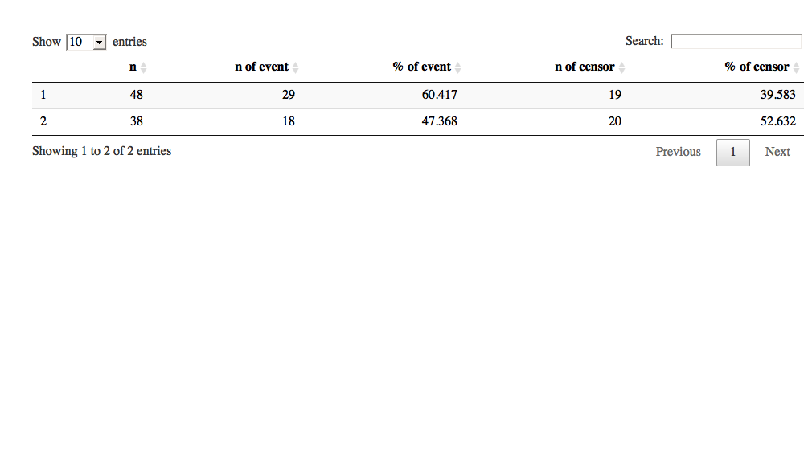
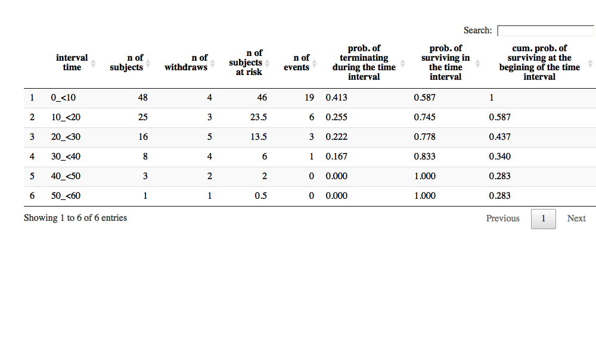

## A user manual for compSurv

November 27, 2016

### Abstract

Survival analysis is described as collection of statistical methods for which the response variable of interest is time until an event occurs. In this context, the time can be days, week, months and years from the beginning of follow-up of an individual until an event occurs, or the age of an individual when the event occurs. Moreover, the event can be death, disease, remission, recovery or any experience of interest that may occur to an individual. A more detailed information can be found in Kleinbaum and Marubini and Valsecchi.

Here we developed an easy-to-use, up-to-date, comprehensive and interactive web-based tool for survival analysis. This tool includes analysis procedures for life table, Kaplan-Meier and Cox regression. Each procedure includes following features:

**Life table:** descriptive statistics, life table, median life time, hazard ratios and comparison tests including Log-rank, Gehan-Breslow, Tarone-Ware, Peto-Peto, Modified Peto-Peto, Flemington-Harrington.

**Kaplan-Meier:** descriptive statistics, survival table, mean and median life time, hazard ratios, comparison tests including Log-rank, Gehan-Breslow, Tarone-Ware, Peto-Peto, Modified Peto-Peto, Flemington-Harrington, and interactive plots such as Kaplan-Meier curves and hazard plots.

**Cox regression:** coefficient estimates, hazard ratios, goodness of fit test, analysis of deviance, save predictions, save residuals, save Martingale residuals, save Schoenfeld residuals, save dfBetas, proportional hazard assumption test, and interactive plots including Schoenfeld residual plot and Log-Minus-Log plot.

**Regularized Cox regression:** variable selection and coefficient estimations using ridge, elastic net and lasso penalties.

**Random survival forests:** individual survival and cumulative hazard predictions using random survival forests, and interactive plots including, survival (with OOB), hazard (with OOB), error rate vs number of tree and cox regression vs random survival forest model. 

### 1.Data upload

This tool requires a dataset in `*.txt` format, which is seperated by `comma`, `semicolon`, `space` or `tab` delimiter. First row of dataset must include header. When the appropriate file is uploaded, the dataset will be appear immediately on the main page of the tool. Alternatively users can upload one of the example datasets provided within the tool for testing and understanding the operating logic of the tool.    

### 2. Analysis Methods

### 2.1. Life Table

A life table can be constructed for a cohort group using the following steps: 

1. Upload your dataset using `Data upload` tab.
2. Select the analysis method as `Life Table` from `Analysis` tab.
3. Select suitable variables for the analysis, such as `survival time`, `status variable`, `category value for status variable` and `factor variable`, if exists.
3. Define an appropriate time interval from beginning to end of study by a specific step.
4. In advanced options, one can change `confidence interval type` as log, log-log or plain, `variance estimation method` as Greenwood or Tsiatis and `reference category` as first or last.
5. Click Run button to run the analysis.

Desired outputs can be selected by clicking Outputs checkbox. Available outputs are; , , median life time, hazard ratio and comparison test.

1. Case summary

2. Life table

